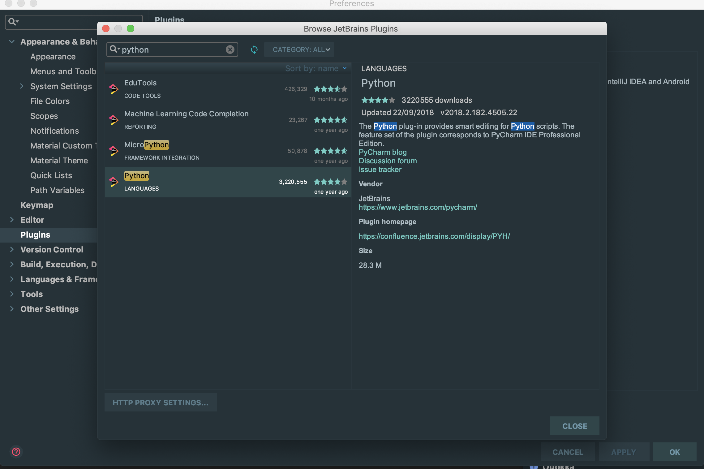

# IntelliJ에서 파이썬 HelloWorld 찍기

## 목적

파이썬을 활용해 알고리즘 공부를 하기 위해 IntelliJ에서 파이썬을 적용해보고 HelloWorld를 출력해본다

### 기대효과

IntelliJ에서 파이썬을 사용할 수 있고 파이썬 문법을 익히기 위한 초기 절차임.

### 적용방법

1. IntelliJ오픈
2. IntelliJ메뉴 &gt; Preference 메뉴 선택
3. plugins검색 후 설
4. IntelliJ Restart

### HelloWorld 출력

1. 설정한 파이썬 디렉토리 선택
2. print\("Hello World"\) 입력
3. 실행

###  사용한 단축키 Mac기준

1. Preference 열기 : command + ,
2. 파이썬 실행 : control + shift + F10

